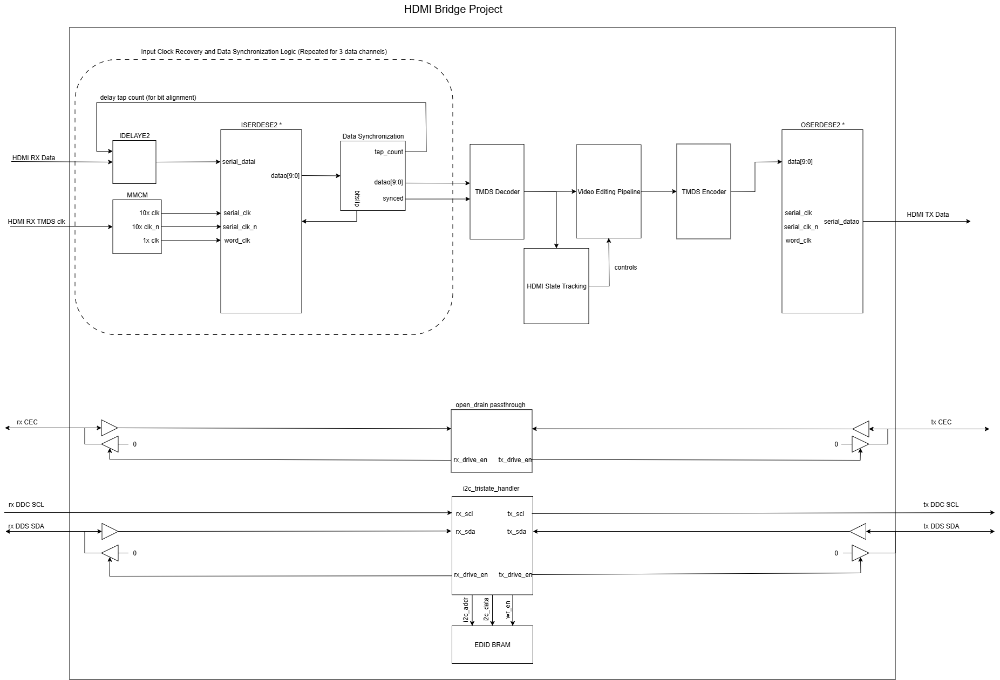

# HDMI Bridge Project

## Project goals:
- First, allow for direct passthrough of video/audio data from a some source -> FPGA sink -> FPGA Source -> monitor
- Once this works properly, track HDMI states and manipulate video data for certain regions of the screen
- Moving forward, integrate with the SoC processor and implement some basic image processing algorithms

## Steps to achieve HDMI passthrough
- Enable I2C DDC communication between the original source and monitor by tracking I2C states and enabling open-drain outputs based on that.
    - Already working properly, laptop recognizes monitor and all settings correctly
- Handle bit alignment and character alignment using Xilinx IP IDELAYE2 and ISERDESE2
    - Use IDELAYE2 to delay data inputs to get proper alignment with the recovered clock
    - This could cause 10-bit characters to be unsynchronized, which will be corrected using bitslip in ISERDESE2.
    - This synchronization will be done by searching for repeated control period words, which should happen at least once every 50 ms according to HDMI standards
    - Currently seeing control words every so often, but do not have full synchronization working yet

